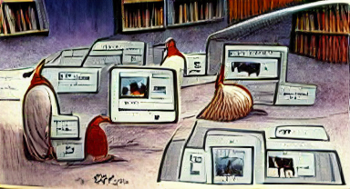

# ENG 3817: Digital Archives

- **Instructor:** Dr. Anastasia Salter
- **Email:** anastasia@ucf.edu; Webcourses preferred
- **Office:** Zoom; Thursday 12 - 3 PM
- **Course Meeting:** Asynchronous Online
  
---

## Contents

- [ENG 3817: Digital Archives](#eng-3817-digital-archives)
  - [Contents](#contents)
  - [Course Description](#course-description)
  - [Course Objectives](#course-objectives)
  - [Materials and Texts](#materials-and-texts)
  - [Evaluation and Grading](#evaluation-and-grading)
  - [Asynchronous Online Course Structure](#asynchronous-online-course-structure)
  - [Weekly Schedule](#weekly-schedule)
    - [Week One: Introduction (Monday, January 10)](#week-one-introduction-monday-january-10)
    - [Week Two: Preservation (Monday, January 17)](#week-two-preservation-monday-january-17)
    - [Week Three: Digital Objects (Monday, January 24)](#week-three-digital-objects-monday-january-24)
    - [Week Four: Challenges (Monday, January 31)](#week-four-challenges-monday-january-31)
    - [Week Five: Craft (Monday, February 7)](#week-five-craft-monday-february-7)
    - [Week Six: Formats (Monday, February 14)](#week-six-formats-monday-february-14)
    - [Week Seven: Metadata (Monday, February 21)](#week-seven-metadata-monday-february-21)
    - [Week Eight: Multimodal (Monday, February 28)](#week-eight-multimodal-monday-february-28)
    - [Spring Break: Enjoy the holiday! (Monday, March 7)](#spring-break-enjoy-the-holiday-monday-march-7)
    - [Week Nine: Tools (Monday, March 14)](#week-nine-tools-monday-march-14)
    - [Week Ten: Timelines (Monday, March 21)](#week-ten-timelines-monday-march-21)
    - [Week Eleven: Memory (Monday, March 28)](#week-eleven-memory-monday-march-28)
    - [Week Twelve: Styles (Monday, April 4)](#week-twelve-styles-monday-april-4)
    - [Week Thirteen: Histories (Monday, April 11)](#week-thirteen-histories-monday-april-11)
    - [Week Fourteen: Futures (Monday, April 18)](#week-fourteen-futures-monday-april-18)
    - [Week Fifteen: Data (Monday, April 25)](#week-fifteen-data-monday-april-25)
    - [Final Reflection (Due Sunday, May 1st)](#final-reflection-due-sunday-may-1st)
  - [General Policies](#general-policies)
    - [Academic Integrity](#academic-integrity)
    - [Responses to Academic Dishonesty, Plagiarism, or Cheating](#responses-to-academic-dishonesty-plagiarism-or-cheating)
    - [Course Accessibility Statement](#course-accessibility-statement)
    - [Land Acknowledgement Statement](#land-acknowledgement-statement)
    - [Campus Safety Statement](#campus-safety-statement)
    - [Deployed Active Duty Military Students](#deployed-active-duty-military-students)
    - [Authorized Events and Religious Observances](#authorized-events-and-religious-observances)
  
---

## Course Description

<i>Digital Archives by Gary Larson, as generated by Pixray</i>

We are surrounded by "content": in the average day, each of us who uses social media (from Facebook and Twitter to Instagram, TikTok, and Discord) shares and creates text, images, video, and even interactive work. We often think of this cultural history we are all constantly creating as simultaneously ephemeral and eternal, and yet the reality is that we are constantly in a state of losing the history of what we have all made. Active preservation is just as essential now as it is in the context of historical work, but the tools have changed: digital archives offer both new promise, and new challenges, to sustaining our access to cultural, literary, and textual history.

In this course we’ll take a hands-on approach to digital archives across a range of “texts,” from digitally-preserved manuscripts to born-digital interactive texts. Throughout, we’ll combine theory and practice, using digital open-source tools for the preservation and curation of text and metadata. We’ll explore the challenges and opportunities that come with emerging platforms, and uncover the vanishing histories of textual forms in the face of changing standards. Our inspiration will include both “official” archives and fan archives, or what Abigail de Kosnik terms “rogue archives,” which offer important models for shaping our digital cultural memory -- from the Internet Archive and the Wayback Machine to the fanfiction hub of Archive of Our Own. Coursework will consist of ongoing discussions and iterative projects building technical and procedural literacy through digital archive technologies and information visualization.

Each week, plan on following the module for all asynchronous activities. Each module will include:

- **Weekly Readings and Lecture.** As this is an asynchronous class, a pre-recorded lecture will be included in every module along with the week's required readings. Required readings might include additional material for viewing or listening, as well as digital archives to explore.
- **Technical Exercises.** Each week will include a step-by-step tutorial working towards the four archive exercises of the semester: an Omeka archive; a Scalar exhibition; a TimelineJS visualization; and a Voyant text analysis.
- **Discussions.** The ten required discussion topics will include reporting back on the technical exercise progress; reflecting on the design and approach of existing archives; and responding to provocations from the readings.

---

## Course Objectives

- Explore principles of traditional and digital archiving across platforms and materialities
- Assess and evaluate archive design, content, usability, and metadata in existing digital humanities projects
- Become familiar with open source tools for digital archiving and exhibition, including Omeka and Scalar
- Develop technical skills with tools for digital archiving and text exploration at scale, using TimelineJS and Voyant
- Understand challenges of copyright and ownership, as well as tensions over "abandonware" and digital works

---

## Materials and Texts

This course requires no texbook or software purchases. The primary texts are available for free through the UCF library, and all additional readings included in the weekly listings are freely available online. To access the textbooks through the UCF library, use the following links:

- Trevor Owens, *Theory and Craft of Digital Preservation.* [Unlimited use ebook available through UCF](https://ucf-flvc.primo.exlibrisgroup.com/permalink/01FALSC_UCF/rh57g9/cdi_askewsholts_vlebooks_9781421426983)
- Abigail d Kosnik, *Rogue Archives.* [Unlimited use ebook available through UCF](https://ebookcentral.proquest.com/lib/ucf/detail.action?docID=5966612)
  
In addition, each module includes samples, tutorials, and resources to guide the projects and discussions.

---

## Evaluation and Grading

| Points  | Assignment Summary | Due Date  |
|---|---|---|
| 5  | **Activity Verification** - Complete the brief survey posted on Webcourses as soon as possible to confirm your enrollment in the course. As this is required by the university, please attend to it as soon as possible at the start of classes. | Friday, January 14, 2022  |
| 50  | **Weekly Discussions** - Weekly discussions (10) will vary, with topics to include reporting back on the technical exercise progress; reflecting on the design and approach of existing archives; and responding to provocations from the readings. There are no discussions on weeks projects are due. | Weekly |
| 40 | **Archive Exercises** - Students will build technical skills through four digital humanities exercises, building an Omeka archive; a Scalar exhibition; a TimelineJS visualization; and a Voyant text analysis.  | See dates in weekly schedule  |
| 5 | **Final Reflection** - In a short written reflection during final exam week, students will connect the readings to their progress in making and analyzing digital archives, and speculate on the future of digital archive design. | |

Students can access their grades and feedback at any time using the Grade Book function of Webcourses. All assignments will be submitted through Webcourses. Plan on checking the site at least twice a week for updates and assignment information. Grades are calculated out of 100 (all listed points above equated to 1% point) following the standard letter scale below:

| 93-100% | A |
| 90-93% | A- |
| 87-89% | B+ |
| 83-86% | B |
| 80-82% | B- |
| 77-79% | C+ |
| 73-76% | C |
| 70-72% | C- |
| 67-69% | C+ |
| 63-66% | C |
| 60-62% | C- |
| Under 60% | F |

Late work is accepted without penalty through the next major assignment deadline. If circumstances require extension beyond that deadline, please reach out to the instructor immediately.

There is one extra credit opportunity, discussion eleven, as listed in the weekly schedule: this opportunity is worth five points, and can replace a missed discussion or partial credit for a missed archive exercise. There are no other extra credit opportunities in this class. Grades will be available through Webcourses and updated weekly.

---

## Asynchronous Online Course Structure

This course uses a fully asynchronous online format, and relies upon students to complete all readings, engage with both course lectures and other online videos, and join in on course discussions. All assignments are due at the close of their listed module, but will be accepted with no penalty for one week. Once an assignment closes, late work will require approval of the instructor: please reach out as soon as possible to discuss.

- The course has no synchronous meetings. Office hour assistance is additionally available both through text on Webcourses messages and via Zoom: Zoom is recommended for advanced technical problems, where screen-sharing might be helpful to resolving errors.
- Students will need access to a reliable internet connection and computer to participate in this course. Both PCs and Macs are welcome: tools are browser-based, and do not require the installation of additional software.
- In the event of an emergency or medical challenge, additional flexibility beyond the grading guidelines is available: when anticipated, students should reach out to the instructor as soon as feasible to form a plan or discuss an incomplete if needed.

All modules open on the listed dates (Mondays), and all assignments close on Sunday nights at 11:59PM as noted throughout the weekly schedule.

---

## Weekly Schedule

### Week One: Introduction (Monday, January 10)

- Read: Owens, Beyond Digital Hype and Digital Anxiety
- Explore: [Florida Memory](https://www.floridamemory.com/)
- Make: Create an Omeka Account
- **Due: Activity Verification (Friday January 14th)**
- **Discussion One**

### Week Two: Preservation (Monday, January 17)

- Read:  Owens, Preservation's Divergent Lineages
- Explore: [Square Dance History Project](https://squaredancehistory.org/)
- Make: Adding Omeka Content
- **Discussion Two**

### Week Three: Digital Objects (Monday, January 24)

- Read: Owens, Understanding Digital Objects
- Explore: [Kentucky Oral History](https://kentuckyoralhistory.org/)
- Make: Understanding Omeka Metadata
- **Discussion Three**

### Week Four: Challenges (Monday, January 31)

- Read: Owens, Challenges and Opportunities of Digital Preservation
- Explore: [*Canada Declassified*](https://declassified.library.utoronto.ca/)
- Make: Finish Omeka Prototype
- **Archive Exercise One: Omeka Due**
  
### Week Five: Craft (Monday, February 7)

- Read: Owens, Craft of Digital Preservation
- Explore: [*Alice Online: The Works and World of Lewis Carroll*](https://scalar.usc.edu/works/alice-online/index)
- Make: Create a Scalar Account
- **Discussion Four**

### Week Six: Formats (Monday, February 14)

- Read: Owens, Managing Copies and Formats
- Explore: [*Performing Archive*](https://scalar.usc.edu/works/performingarchive/index)
- Make: Connecting Archives in Scalar
- **Discussion Five**
  
### Week Seven: Metadata (Monday, February 21)

- Read: Owens, Arranging and Describing Digital Objects
- Explore: [*Bodies and Structures 2.0*](https://bodiesandstructures.org/bodies-and-structures-2/index)
- Make: Linking and Representing Ideas in Scalar
- **Discussion Six**

### Week Eight: Multimodal (Monday, February 28)

- Read: Owens, Enabling Multimodal Access and Use
- Explore: Explore: [*Pathfinders: Documenting the Experience of Early Digital Literature.*](https://scalar.usc.edu/works/pathfinders/index)
- Make: Finish Scalar Exhibition
- **Archive Exercise Two: Scalar Due**

### Spring Break: Enjoy the holiday! (Monday, March 7)

### Week Nine: Tools (Monday, March 14)

- Read: Owens, Tools for Looking Forward
- Explore: [*The Knotted Line*](https://scalar.usc.edu/anvc/the-knotted-line/index)
- Make: Working with Google Sheets
- **Discussion Seven**

### Week Ten: Timelines (Monday, March 21)

- Read: De Kosnik, Introduction and Key Terms
- Explore: [*Throughlines: Social Injustice and Activism in Los Angeles*](https://scalar.usc.edu/works/throughlines/index)
- Make: Embedding Multimodal Content
- **Discussion Eight**

### Week Eleven: Memory (Monday, March 28)

- Read: De Kosnik, Memory Machine Myth
- Explore: [Internet Archive](https://archive.org/)
- Make: Finishing your Timeline
- **Archive Exercise Three: TimelineJS Due**
  
### Week Twelve: Styles (Monday, April 4)

- Read: De Kosnik, Archival Styles
- Explore: [Robots Reading Vogue](https://dhlab.yale.edu/projects/vogue/)
- Make: Choosing a Set of Texts
- **Discussion Nine**

### Week Thirteen: Histories (Monday, April 11)

- Read: De Kosnik, Print Fans vs Net Fans
- Explore: [Archive of Our Own](https://archiveofourown.org/)
- Make: Visualizing Words
- **Discussion Ten**

### Week Fourteen: Futures (Monday, April 18)

- Read: De Kosnik, Archontic Production
- Explore: [LGBTQ Video Game Archive](https://lgbtqgamearchive.com/)
- Make: Understanding a Corpus
- **Discussion Eleven (Optional Extra Credit / Make-up Discussion)**

### Week Fifteen: Data (Monday, April 25)

- Read: De Kosnik, Fan Data
- Explore: [Archive Team](https://wiki.archiveteam.org/)
- Make: Finishing
- **Archive Exercise Four: Voyant Due**

### Final Reflection (Due Sunday, May 1st)

- Submit & complete your reflection, as well as any approved late work, by 11:59PM on Sunday, May 1st!

---

## General Policies

### Academic Integrity

[The Center for Academic Integrity (CAI)](http://academicintegrity.org/) defines academic integrity as a commitment, even in the face of adversity, to five fundamental values: honesty, trust, fairness, respect, and responsibility. From these values flow principles of behavior that enable academic communities to translate ideals into action.

**UCF Creed:** Integrity, scholarship, community, creativity, and excellence are the core values that guide our conduct, performance, and decisions.

1. Integrity: I will practice and defend academic and personal honesty.
2. Scholarship: I will cherish and honor learning as a fundamental purpose of my membership in the UCF community.
3. Community: I will promote an open and supportive campus environment by respecting the rights and contributions of every individual.
4. Creativity: I will use my talents to enrich the human experience.
5. Excellence: I will strive toward the highest standards of performance in any endeavor I undertake.

Students should familiarize themselves with [UCF’s Rules of Conduct](https://scai.sdes.ucf.edu/student-rules-of-conduct/). According to Section 1, “Academic Misconduct,” students are prohibited from engaging in

1. Unauthorized assistance: Using or attempting to use unauthorized materials, information or study aids in any academic exercise unless specifically authorized by the instructor of record. The unauthorized possession of examination or course-related material also constitutes cheating.
2. Communication to another through written, visual, electronic, or oral means: The presentation of material which has not been studied or learned, but rather was obtained through someone else’s efforts and used as part of an examination, course assignment, or project.
3. Commercial Use of Academic Material: Selling of course material to another person, student, and/or uploading course material to a third-party vendor without authorization or without the express written permission of the university and the instructor. Course materials include but are not limited to class notes, Instructor’s PowerPoints, course syllabi, tests, quizzes, labs, instruction sheets, homework, study guides, handouts, etc.
4. Falsifying or misrepresenting the student’s own academic work.
5. Plagiarism: Using or appropriating another’s work without any indication of the source, thereby attempting to convey the impression that such work is the student’s own.
6. Multiple Submissions: Submitting the same academic work for credit more than once without the express written permission of the instructor.
7. Helping another violate academic behavior standards.
8. Soliciting assistance with academic coursework and/or degree requirements.

### Responses to Academic Dishonesty, Plagiarism, or Cheating

Students should also familiarize themselves with the procedures for academic misconduct in UCF’s student handbook, [The Golden Rule](https://goldenrule.sdes.ucf.edu/). UCF faculty members have a responsibility for students’ education and the value of a UCF degree, and so seek to prevent unethical behavior and respond to academic misconduct when necessary. Penalties for violating rules, policies, and instructions within this course can range from a zero on the exercise to an “F” letter grade in the course. In addition, an Academic Misconduct report could be filed with the Office of Student Conduct, which could lead to disciplinary warning, disciplinary probation, or deferred suspension or separation from the University through suspension, dismissal, or expulsion with the addition of a “Z” designation on one’s transcript.

### Course Accessibility Statement

This course is built with universal design for learning principles in mind: if you encounter challenges with any of the course materials, assignments, platforms, or requirements, please reach out for assistance, and know that additional support is always available regardles of documentation.

Additionally, the University of Central Florida is committed to providing access and inclusion for all persons with disabilities. Students with disabilities who need access to course content due to course design limitations should contact the professor as soon as possible. Students should also connect with [Student Accessibility Services (SAS)](http://sas.sdes.ucf.edu/) (Ferrell Commons 185, sas@ucf.edu, phone 407-823-2371). For students connected with SAS, a Course Accessibility Letter may be created and sent to professors, which informs faculty of potential course access and accommodations that might be necessary and reasonable. Determining reasonable access and accommodations requires consideration of the course design, course learning objectives and the individual academic and course barriers experienced by the student. Further conversation with SAS, faculty and the student may be warranted to ensure an accessible course experience.

### Land Acknowledgement Statement

The UCF Department of English acknowledges that our main campus stands on the traditional territories of the Seminole and Timucua peoples, and that other Native American traditional territories exist throughout Florida where our regional campuses are located. We collectively recognize their continuing connection to the land, water, and air and pay respect to their elders past, present, and emerging. We recognize the continuing consequences of colonialism on Indigenous peoples and their resilience in the face of colonial and state sponsored violence, and we fully endorse Indigenous Sovereignty.

### Campus Safety Statement

Emergencies on campus are rare, but if one should arise during class, everyone needs to work together. Students should be aware of their surroundings and familiar with some basic safety and security concepts.

- In case of an emergency, dial 911 for assistance.
- Every UCF classroom contains an emergency procedure guide posted on a wall near the door. Students should make a note of the guide’s physical location and review the [online version](http://emergency.ucf.edu/emergency_guide.html).
- Students should know the evacuation routes from each of their classrooms and have a plan for finding safety in case of an emergency.
- If there is a medical emergency during class, students may need to access a first-aid kit or AED (Automated External Defibrillator). To learn where those are located, see [locations](https://ehs.ucf.edu/automated-external-defibrillator-aed-locations).
- To stay informed about emergency situations, students can sign up to receive UCF text alerts by going to [MyUCF](https://my.ucf.edu) and logging in. Click on “Student Self Service” located on the left side of the screen in the toolbar, scroll down to the blue “Personal Information” heading on the Student Center screen, click on “UCF Alert”, fill out the information, including e-mail address, cell phone number, and cell phone provider, click “Apply” to save the changes, and then click “OK.”
- Students with special needs related to emergency situations should speak with their instructors outside of class.
- To learn about how to manage an active-shooter situation on campus or elsewhere, consider viewing this [video](https://youtu.be/NIKYajEx4pk).

### Deployed Active Duty Military Students

Students who are deployed active duty military and/or National Guard personnel and require accommodation should contact their instructors as soon as possible after the semester begins and/or after they receive notification of deployment to make related arrangements.

### Authorized Events and Religious Observances

Students who represent the university in an authorized event or activity (for example, student-athletes) and who are unable to meet a course deadline due to a conflict with that event must provide the instructor with documentation in advance to arrange a make-up. No penalty will be applied.

Students must notify their instructor in advance if they intend to miss class for a religious observance. For more information, see the [UCF policy](http://regulations.ucf.edu/chapter5/documents/5.020ReligiousObservancesFINALJan19.pdf).
